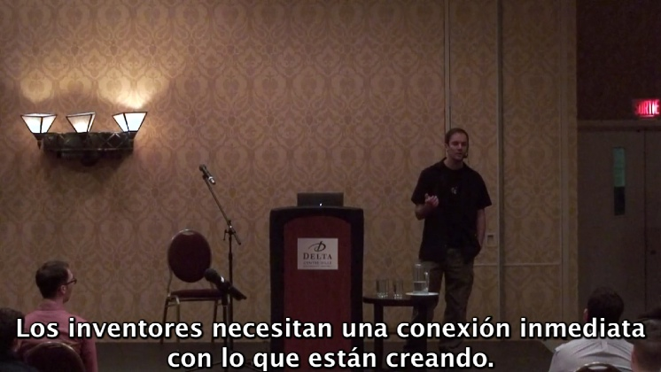
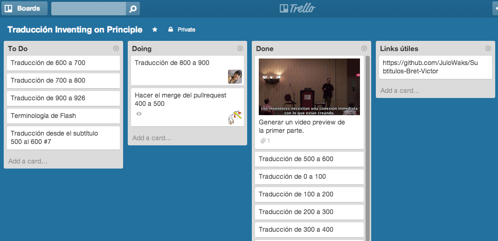

Subtitulos: Bret Victor
=======================

Este repositorio contiene una traducción comunitaria
de la charla "Inventing on Priciple" de Bret Victor:

Queremos traducir el contenido de esta charla porque
pensamos que es muy inspiradora para todos los programadores.

Te invitamos a participar de la traducción, si tienes ganas
de ayudarnos simplemente realiza un fork y comienza.

Podés ver la primer parte de la traducción aquí:

 * http://youtu.be/ZosXDYBKJ88

## ¿Cómo contributir?

Tenemos la transcripción de la charla de Bret en inglés, y nos dividimos partes de ese subtítulo para traducir.

Si quieres contribuir, envianos tu nombre de usuario en www.trello.com, así te compartimos este board con las secciones:

